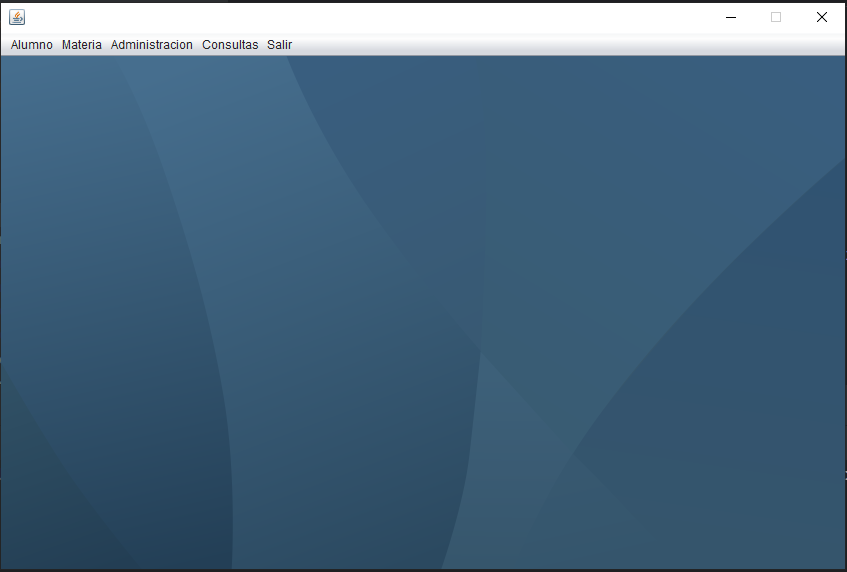
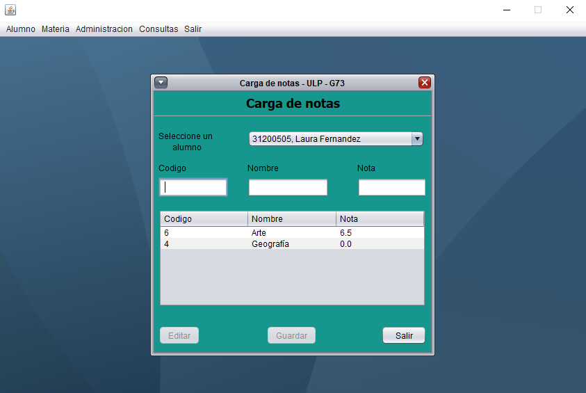
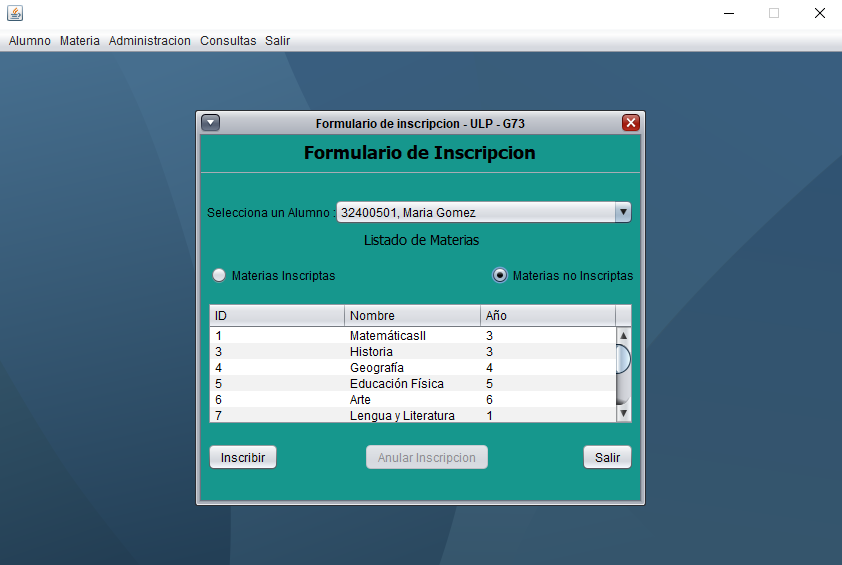
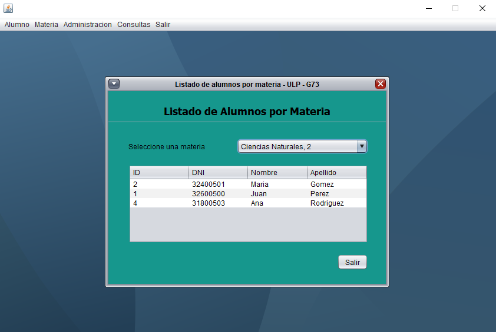
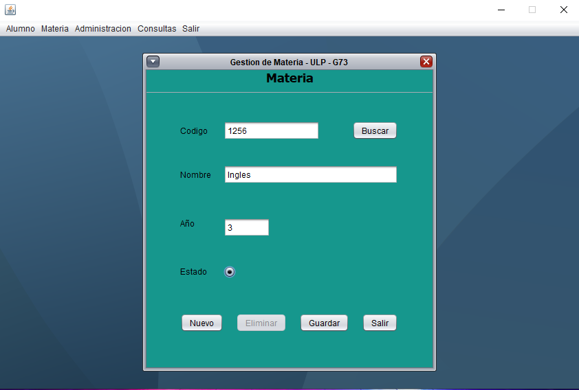

# 📚 ULP - Sistema de Gestión Académica

Aplicación de escritorio desarrollada en **Java Swing** para la gestión integral de alumnos, materias e inscripciones.  
El sistema permite **crear, buscar, modificar y eliminar registros** de estudiantes, administrar las **materias disponibles** y gestionar las **inscripciones de alumnos a materias**.  
Incluye validaciones de entrada, componentes gráficos modernos y conexión a base de datos **MariaDB/MySQL**.

---

## ✨ Características
- 🖥️ Interfaz gráfica amigable con **Swing** (`JInternalFrame`).
- 🔒 Validación de campos mediante **DocumentFilter**:
  - Solo números.
  - Solo letras.
  - Rango numérico (1 a 100.000.000).
- 📂 Conexión a base de datos mediante **DAO (Data Access Object)**.
- 📝 Operaciones CRUD completas:
  - **Alumnos**: alta, baja, modificación y búsqueda.
  - **Materias**: creación, edición y eliminación.
  - **Inscripciones**: inscripción de alumnos a materias, consulta y baja.
- 📅 Selector de fechas con `JDateChooser`.
- 🎨 Diseño visual con colores personalizados y botones habilitados/deshabilitados según validaciones.

---

## 🛠️ Tecnologías usadas
- ☕ **Java JDK 17+**
- 🎨 **Java Swing**
- 🗄️ **MariaDB/MySQL**
- 🔌 **JDBC**
- 📦 Librerías externas:
  - [`jcalendar-1.4.jar`](https://mvnrepository.com/artifact/com.toedter/jcalendar/1.4)
  - [`mariadb-java-client-3.2.0.jar`](https://mvnrepository.com/artifact/org.mariadb.jdbc/mariadb-java-client/3.2.0)

---

## 📦 Requisitos
- Java JDK 17 o superior.
- IntelliJ IDEA o NetBeans.
- MariaDB/MySQL (puede usarse XAMPP para levantar el servidor).
- Librerías externas: `jcalendar-1.4.jar`, `mariadb-java-client-3.2.0.jar`.

---

## ⚙️ Configuración

### 1. Clonar el repositorio
```bash
 https://github.com/pablobrizuela23/sistema-gestion-academica.git
```
---

### 2. Abrir el proyecto
- Abrir en IntelliJ IDEA o NetBeans.

- Configurar el SDK de Java (mínimo JDK 17).

---

### 3. Agregar librerías externas
### En IntelliJ:

File > Project Structure > Modules > Dependencies > + > JARs or Directories

Seleccionar:

- jcalendar-1.4.jar

- mariadb-java-client-3.2.0.jar

Aplicar cambios.

---

### 4. Configurar la base de datos
1. Iniciar XAMPP y activar el módulo MySQL.
(Si no usas XAMPP, asegúrate de tener MariaDB/MySQL corriendo en tu sistema).

2. Crear la base de datos y tablas necesarias:

```bash
CREATE DATABASE ulp;
USE ulp;

CREATE TABLE alumno (
    idAlumno INT AUTO_INCREMENT PRIMARY KEY,
    dni INT NOT NULL,
    nombre VARCHAR(50),
    apellido VARCHAR(50),
    fechaNacimiento DATE,
    estado BOOLEAN
);

CREATE TABLE materia (
    idMateria INT AUTO_INCREMENT PRIMARY KEY,
    nombre VARCHAR(50),
    año INT NOT NULL,
    estado BOOLEAN
);

CREATE TABLE inscripcion (
    idInscripcion INT AUTO_INCREMENT PRIMARY KEY,
    idAlumno INT,
    idMateria INT,
    nota DOUBLE,
    FOREIGN KEY (idAlumno) REFERENCES alumno(idAlumno),
    FOREIGN KEY (idMateria) REFERENCES materia(idMateria)
);


```

3. Verifica que el usuario y contraseña de MySQL coincidan con los que usa tu clase Conexion.
Ejemplo típico:

```bash
Connection con = DriverManager.getConnection(
    "jdbc:mysql://localhost:3306/ulp", "root", ""
);


```
## ▶️ Uso
1. Inicia el servidor MySQL desde XAMPP (o directamente MariaDB).

2. Abre el proyecto en IntelliJ.

3. Configura una Run Configuration para ejecutar la clase principal (ejemplo: Main).

4. Ejecuta el programa:

  - Run > Run 'Main'

5. Se abrirá la ventana Swing con las siguientes opciones:

  - Gestión de Alumnos: alta, baja, modificación y búsqueda.

  - Gestión de Materias: administración de materias disponibles.

  - Gestión de Inscripciones: inscripción de alumnos a materias, consulta de inscripciones y eliminación.

---

## 📸 Capturas de pantalla








---

## 👨‍💻 Autor
- Pablo Brizuela
- Javier Zader
- Iván Moreno
- Rocío Lencina
   
Proyecto académico de la Universidad de La Punta (ULP).

---

## 🙏 Agradecimientos
- A la Universidad de La Punta (ULP) por el marco académico.

- A la comunidad de Java por las librerías y soporte.

- A todos los que colaboran en mejorar este proyecto.

 
